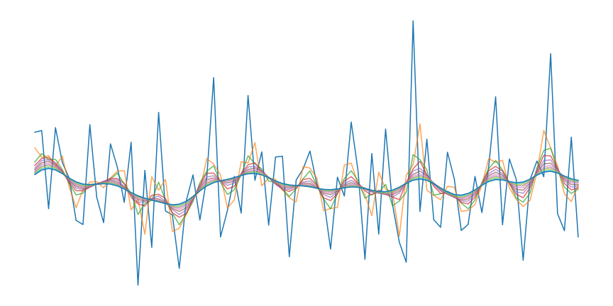
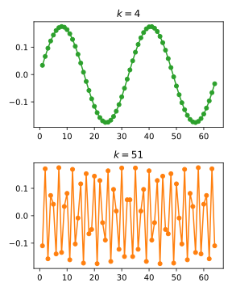
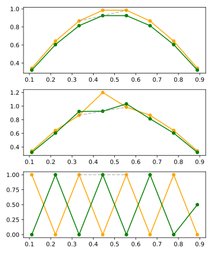
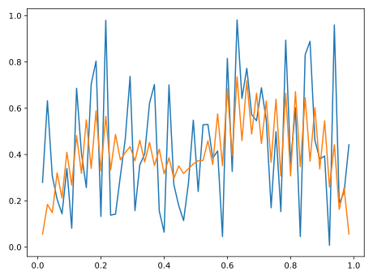
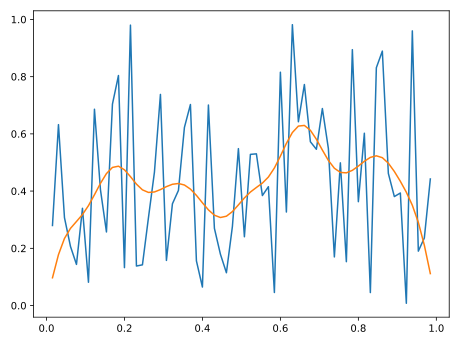
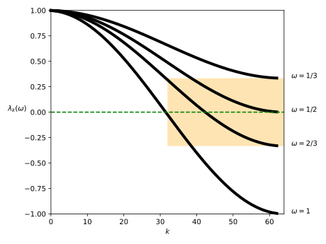
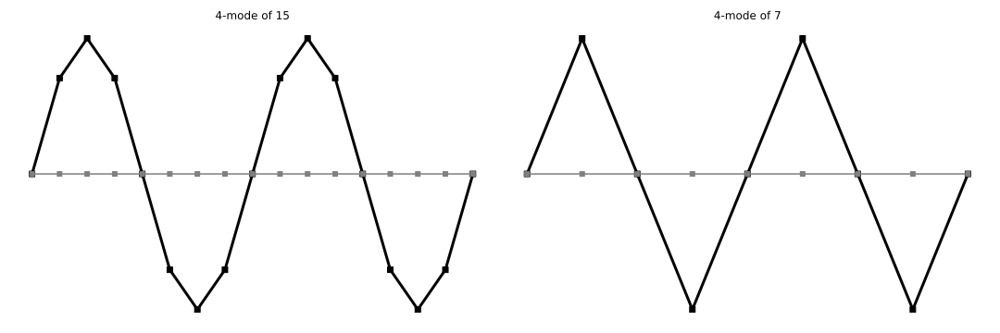

# Multigrid Methods

Y. Saad, *Iterative Methods for Sparse Linear Systems*, §§13.3–13.5

**Presenter: Jiaze Li**

 
 
 
 

---

## Model Problem

1D model problem

$$
\begin{aligned}
-u_{x x} & =f \\
u(0) & =u(1)=0
\end{aligned}
$$

With finite differences

$$
\frac{-u_{i-1}+2 u_i-u_{i+1}}{h^2}=f_i \quad i=1, \ldots, n \quad u_0=u_{n+1}=0
$$

As matrix form

$$
\frac{1}{h^2}\left[\begin{array}{ccc}
2 & -1 & \\
-1 & \ddots & \ddots \\
& \ddots &
\end{array}\right] \left[\begin{array}{c}
u_1 \\
\vdots \\
u_{n}
\end{array}\right] = 
\left[\begin{array}{c}
f_1 \\
\vdots \\
f_{n}
\end{array}\right]
$$

---

## Use the Jacobi Method
 

Solve the problem
$$
A x=b
$$

Iteratively
$$
x^{(1)}=x^{(0)}+D^{-1} r^{(0)}
$$

 

> Or think of it as a gradient descent with
> fixed step size $1$ and preconditioner $D^{-1}$

Exact solution
$$
x^*
$$
Error
$$e_0 = x^*-x_0$$
Residual
$$r_0 = b-Ax_0 = A e_0$$

---

## Some Convergence Test

The number of iterations required to get the tolerance of 1.0E-10 (RMS residual norm)

Burkardt, J., 2011. Jacobi Iterative Solution of Poisson’s Equation in 1D [online]

The computational cost is about $\mathcal{O}(n^3)$. But why is that? Let's look at the details.

---

<!-- _header: Model Problem -->

Look at the matrix
$$
A=\left[\begin{array}{ccccc}
2 & -1 & & & \\
-1 & 2 & -1 & & \\
& \ddots & \ddots & \ddots & \\
& & -1 & 2 & -1 \\
& & & -1 & 2
\end{array}\right]
$$

The eigenvalues
$$
\lambda_k=4 \sin ^2\left(\frac{k \pi}{2(n+1)}\right)
$$

The eigenvectors (are Fourier modes)

$$
\left(v_k\right)_j=\sin \left(\frac{(j+1) * k \pi}{n+1}\right)
$$

Eigenvectors for $n=64$

Performs like $\textcolor{#2ba02b}{\text{low}}$ and $\textcolor{#ff7f0f}{\text{high}}$ frequencies

---

## What does Jacobi do to error?

The error propagation
$$
e \leftarrow T e \quad T=I-D^{-1} A
$$

$$
T=\left[\begin{array}{ccccc}
0 & 1/2 & & & \\
1/2 & 0 & 1/2 & & \\
& \ddots & \ddots & \ddots & \\
& & 1/2 & 0 & 1/2 \\
& & & 1/2 & 0
\end{array}\right]
$$

It is averaging

$$
\textcolor{#2ba02b}{e_i^{\text {new }}} \leftarrow \frac{1}{2}\left(\textcolor{#ff7f0f}{e_{i-1}^{\text {old }}}+\textcolor{#ff7f0f}{e_{i+1}^{\text {old }}}\right)
$$

For different types of error

It *averages out* certain frequency quickly

---

## From Jacobi to weighted-Jacobi

$$
u \leftarrow u+D^{-1} r
$$

$$
u \leftarrow u+\omega D^{-1} r , \omega = 2 / 3
$$

Like a low-pass filter. Why?

---

## Fourier Analysis

Using the eigenvectors of the error propagation $T$ as a basis for the error space
$$
e^{(0)}=\sum_{k=1}^n c_k v_k
$$

Then the error transforms like
$$
e \leftarrow\left(I-\omega D^{-1} A\right) e=T e
$$

$$
e^{(\sigma)} = T e^{(0)} =\sum_{k=1}^n c_k T^\sigma v_k =\sum_{k=1}^n c_k \lambda_k^\sigma v_k
$$

Converge with the factor $\|T\|$ or $\rho(T)$

---

<!-- _header: Fourier Analysis -->

For Jacobi and weighted-Jacobi
$$
\begin{aligned}
T=I-D^{-1} A & \longrightarrow \lambda_k=1-\frac{1}{2} \cdot 4 \cdot \sin ^2\left(\frac{k \pi}{2(n+1)}\right) \\
T=I-(2 / 3) D^{-1} A & \longrightarrow \lambda_k=1-\frac{2}{3} \cdot \frac{1}{2} \cdot 4 \cdot \sin ^2\left(\frac{k \pi}{2(n+1)}\right)
\end{aligned}
$$

The spectral radius $\rho_n \approx 1-{C}/{n^2}$ (confirms the quadratic **#iteration**)

But
$$
e^{(\sigma)} =\sum_{k=1}^n c_k \lambda_k^\sigma v_k
$$
error on different direction $v_k$, or frequency $k$, is reduced by different magnitude of $\lambda_k$

---

<!-- _header: Fourier Analysis -->

$\lambda_k$ corresponding to different $\omega$

For $\omega = 2/3$, the high frequency part of the error is reduced by (at least) $1/3$ 

> **Smoothing factor** of $T$: the maximum magnitude of the upper half spectrum

Maybe it's possible to apply this 1/3 reduction on half the error, on and on?

---

## How can we turn low frequency errors to high frequency?

Sampling on a coarse grid

After this, smooth modes look like oscillatory modes, with little loss of information.

---

## So far we got

Classical iterative methods converge slowly as $n \uparrow$, but have the smoothing property.

Low-frequency information is well approximated on the coarse grid and becomes high-frequency.

## Next questions

How to transfer between fine and coarse?

What do we do “solve” on a coarse grid?

---

## Remind the Projection Methods

Look for the "best" update:
$$
x_1 \leftarrow x_0+u
$$

Over a smaller space
$$
\min _{u \in \operatorname{span}\{V\}}\left\|x^*-x_1\right\|
$$

Then $u=V y$
$$
V^T V y=V^T e_0
$$

So the update looks like
$$
x_1=x_0+V\left(V^T V\right)^{-1} V^T e_0
$$

---

<!-- _header: Remind the Projection Methods -->

Look at the $A$-norm
$$
\min _{u \in \text { span }\{V\}}\left\|x^*-x_1\right\|_A
$$

Then
$$
V^T A V y=V^T A e_0 =V^T r_0
$$

So that
$$
x_1=x_0+V\left(V^T A V\right)^{-1} V^T r_0
$$

The error
$$
e_1 = (I-\underbrace{\textcolor{green}{V\left(V^T A V\right)^{-1} V^T A}}_\text{A-orthogonal projection}) e_0
$$

---

TODO:
- Restriction and Prolongation
- Two-grid
- How Accurate is it?
- Convergence
- Multigrid W/V cycle
